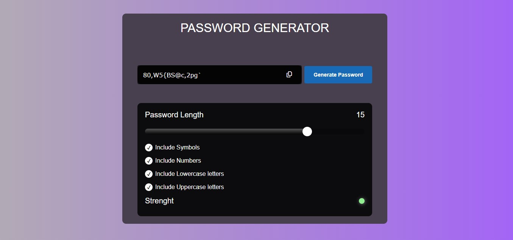
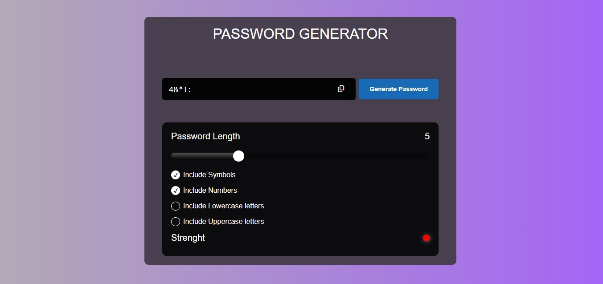

# Random Password Generator

I have recently developed a Random Password Generator web app using JavaScript, HTML, and CSS. This app enables users to generate a random password by selecting specific elements to include, such as uppercase letters, lowercase letters, symbols, and numbers, or a combination of these. Users can also choose which elements to exclude and specify the desired length of the password. Additionally, the app provides feedback on the strength of the generated password. 

 
